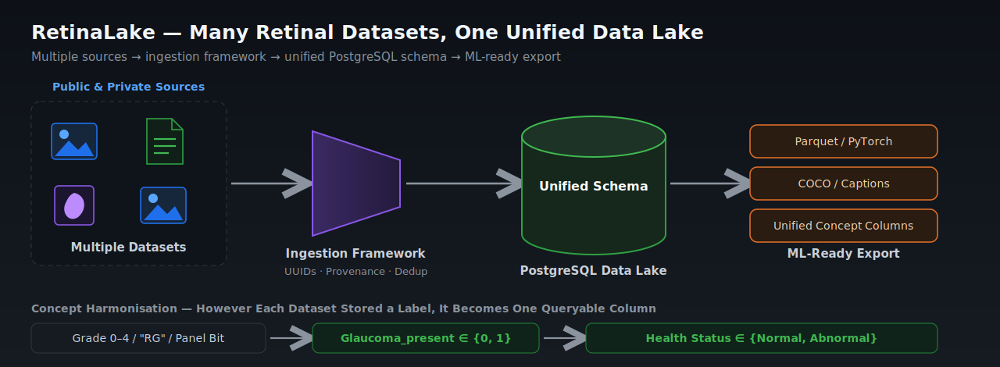
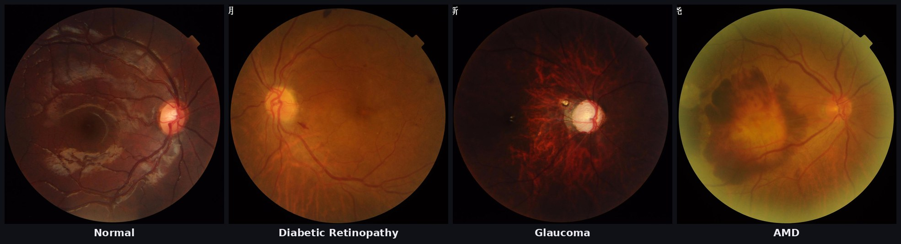
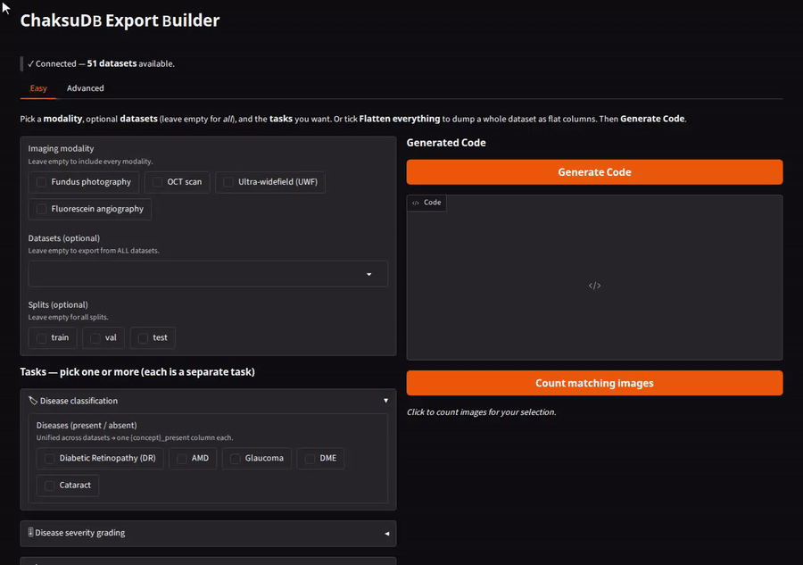

# RetinaLake: A Unified Data Lake Framework for Harmonising Heterogeneous Retinal Datasets

[](LICENSE) [](https://www.python.org/) [](https://www.postgresql.org/)

<p align="center">
  
</p>
<p align="center"><em><strong>Figure 1.</strong> The RetinaLake pipeline. Heterogeneous public and private retinal datasets are passed through a
deterministic ingestion framework into a single PostgreSQL <strong>data lake</strong>, from which ML-ready exports are drawn.
Whatever convention a dataset used to record a label is harmonised into one queryable column.</em></p>

## 1. Motivation

Medical imaging datasets are notoriously heterogeneous. The same clinical fact is stored a dozen different ways:

- **Disease grading** appears as ICDR `0–4`, ICD-9 codes, ETDRS levels, or binary referable/non-referable flags.
- **Disease presence** appears as per-image binaries, multi-label one-hot panels (RFMiD, ODIR-5K), or string labels (`"RG"`).
- **Segmentation** appears as binary PNG masks, multi-class label maps, hand-drawn contours, XML polygons, or soft attention maps.
- **Quality**, **localization**, **clinical free-text**, and **patient demographics** each have their own idiosyncratic encodings.

Training a model across these datasets, or even *counting* how many glaucoma-positive images exist corpus-wide, normally
means writing bespoke parsing code per dataset and reconciling incompatible label spaces by hand. RetinaLake removes that
work by harmonising everything once, at ingest time, into a single schema.

## 3. Corpus coverage

| Annotation family                 | Representative datasets                                                          | Harmonised / queryable output                                                                 |
| --------------------------------- | -------------------------------------------------------------------------------- | --------------------------------------------------------------------------------------------- |
| **Disease grading**         | EYEPACS, MESSIDOR(-2), IDRiD, APTOS, DeepDRiD, OIA-DDR, DDR, BRSET, mBRSET, MMAC | `scaled_grade` on a canonical scale; per-disease `*_grade` columns                        |
| **Disease classification**  | ODIR-5K, RFMiD, RFMiD2, MuReD, ACRIMA, LAG, AIROGS, JustRAIGS, Cataract          | `{concept}_present ∈ {0,1}` per disease, unified across binary / multi-label / multi-class |
| **Segmentation**            | DRIVE, FIVES, STARE, CHASE-DB1, HRF, Drishti-GS1, ORIGA, REFUGE, IDRiD, e-ophtha | canonical binary masks (lesions, OD, cup, vessels) under`processed/`                        |
| **Artery / vein**           | AV-DRIVE, RITE, LES-AV, Fundus-AVSeg                                             | A/V class masks                                                                               |
| **Localization**            | IDRiD, G1020, DRIONS-DB, MAPLES-DR                                               | bounding boxes, keypoints, OD/fovea centre points (COCO-exportable)                           |
| **Quality assessment**      | DeepEyeNet, BRSET, DeepDRiD                                                      | quality / gradability / artifact dimensions via`quality_types`                              |
| **Clinical & keywords**     | DeepEyeNet, BRSET, patient demographics                                          | free-text descriptions, diagnostic keywords, patient metadata                                 |
| **Health status (derived)** | *all of the above*                                                             | corpus-wide`health_status ∈ {normal, abnormal}`                                            |

> Exact image and annotation counts depend on which of the 54 datasets you ingest (RetinaLake stores no pixels itself), so
> they are reported by your own database after ingestion rather than hard-coded here.

### 3.1 What the images look like

Below are representative fundus photographs drawn from one ingested dataset (**FIVES**, dataset `13`), one per disease
class. RetinaLake stores each of these as an `images` row with harmonised labels: the `Normal` example yields
`health_status = normal`; the others yield `health_status = abnormal` plus the matching `{concept}_present = 1`.

<p align="center">
  
</p>
<p align="center"><em><strong>Figure 2.</strong> Colour fundus photographs by class (samples from the FIVES dataset, ingested as dataset 13).
Left→right: <strong>Normal</strong> (healthy disc and macula); <strong>Diabetic Retinopathy</strong> (microaneurysms / haemorrhages
scattered across the posterior pole); <strong>Glaucoma</strong> (enlarged, excavated optic-disc cup); <strong>AMD</strong> (macular
pigmentary and atrophic change). In RetinaLake these four files become four <code>images</code> rows whose differing
source labels resolve to the same <code>dr_present</code> / <code>glaucoma_present</code> / <code>amd_present</code> and
<code>health_status</code> columns.</em></p>

---

## 🚀 Quick Start

The whole flow is **start the database with Docker → point it at your datasets → build the lake → export**.

### Prerequisites

- **Docker** + **Docker Compose**
- **Python 3.11+** and **[uv](https://docs.astral.sh/uv/)**

### 1. Clone & install

```bash
git clone --recurse-submodules https://github.com/anirudhamar04/RetinaLake.git
cd RetinaLake
uv sync
```

### 2. Start PostgreSQL (and initialise the schema)

```bash
docker compose up -d
```

This launches PostgreSQL and **applies `schema/schema.sql` automatically** on first run — all
tables plus the grade-conversion triggers. Nothing else to create by hand.

### 3. Configure

```bash
cp .env.example .env
```

The defaults already match `docker-compose.yml`, so it works out of the box. Adjust
`STORAGE_DATA_ROOT` / `STORAGE_LOCAL_ROOT` if you keep data elsewhere.

### 4. Add your datasets

RetinaLake redistributes **no** image data. Download the datasets you want and place each one
under `STORAGE_DATA_ROOT` using the **exact folder name and layout** documented in
[**`docs/data/`**](docs/data/README.md) — that page has the full catalogue, source links, and
the expected on-disk structure.

### 5. Build the lake

```bash
uv run python scripts/setup_full_database.py
```

One command bootstraps the grading-scale vocabulary and ingests every dataset you placed on disk
(idempotent — safe to re-run).

### 6. Assign train / val / test splits

```bash
uv run python scripts/assign_splits.py
```

Gives every dataset a complete, stratified **train / val / test** split registered as
`user_defined`. Datasets with no splits get a fresh ≈81/9/10 split; those with only train+test
get a val set carved out; already-complete ones are re-registered unchanged. The Export Builder's
**Easy** tab reads these `user_defined` splits by default, so run this before exporting.

```bash
# only specific datasets, or re-split everything
uv run python scripts/assign_splits.py --datasets G1020 CHASEDB1 HRF
uv run python scripts/assign_splits.py --force
```

### 7. Export with the GUI

```bash
uv run python scripts/export_builder.py
```

A **Gradio** app (Easy + Advanced tabs) lets you compose an `ExportSpec` interactively and pull
the result as Parquet / a PyTorch `DataLoader` / COCO.

<p align="center">
  
</p>
<p align="center"><em><strong>Figure 3.</strong> The Export Builder's <strong>Easy</strong> tab — pick a modality (Fundus), a dataset
(DDR) and a task (grade Diabetic Retinopathy), then <strong>Generate Code</strong> and <strong>Count matching images</strong>.</em></p>

The equivalent in code:

```python
from chaksudb.export import ExportSpec, export

spec = ExportSpec(dataset_names=["MESSIDOR"], annotation_tasks=["grading"])
export(spec, parquet_path="out.parquet")
```

See the [Export Data Guide](docs/library/export_data_guide.md) for the full `ExportSpec` reference.

---

## 📚 Documentation

Everything beyond this quick start lives in [`docs/`](docs/README.md):

| Guide                                                                         | What it covers                                                  |
| ----------------------------------------------------------------------------- | --------------------------------------------------------------- |
| [Architecture](docs/architecture.md)                                           | How the pieces fit + a staged route through the codebase        |
| [Database Setup](docs/library/database_setup.md)                               | The database, schema, and triggers (Docker or manual)           |
| [Schema Reference](docs/library/schema_reference.md)                           | Every table, column, index, and storage locator                 |
| [Storage Architecture](docs/library/storage_architecture.md)                   | `data/` vs `processed/`, when masks are converted           |
| [Ingestion Framework](docs/library/ingestion_framework.md)                     | Adapters, task processors, provenance, mask conversion          |
| [Grading-Scale Normalisation](docs/library/grading_scale_normalization.md)     | Cross-scale mapping,`scaled_grade`, triggers                  |
| [Export Data Guide](docs/library/export_data_guide.md)                         | `ExportSpec`, formats, transforms, end-to-end examples        |
| [Transforms](docs/library/transforms.md)                                       | Spatial + photometric transform pipeline                        |
| [IQA &amp; ROI Detection](docs/library/iqa_roi_detection.md)                   | AutoMorph quality scoring + fundus ROI circles                  |
| [Connection-Pool Configuration](docs/library/connection_pool_configuration.md) | Async pool tuning                                               |
| [Development](docs/library/development.md)                                     | Project structure, design principles, testing, adding a dataset |
| [Datasets](docs/data/README.md)                                                | The 54-dataset catalogue, sources, and on-disk layout           |

---

## 📄 License & Attribution

RetinaLake's **code** (the `chaksudb` library) is released under the [Apache License 2.0](LICENSE). This license covers the
schema, ingestion framework, and export toolkit only — **not** the datasets, which remain under
their respective owners' licenses (see [the dataset catalogue](docs/data/README.md)).

Image-quality scoring and fundus ROI detection use the vendored
[**AutoMorph**](https://github.com/rmaphoh/AutoMorph) pipeline (included as a git submodule under
`external/automorph/`, under its own license). If you use these features, please cite AutoMorph.

---

**Built with Python 3.11+ and PostgreSQL for reproducible ophthalmic imaging research.**